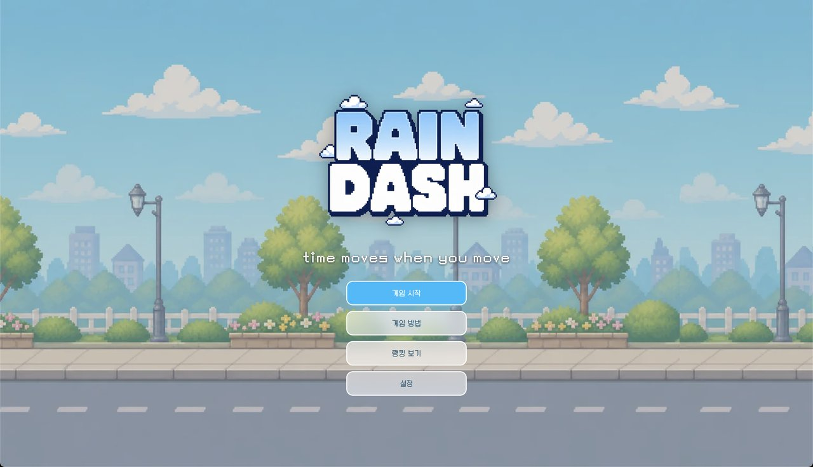
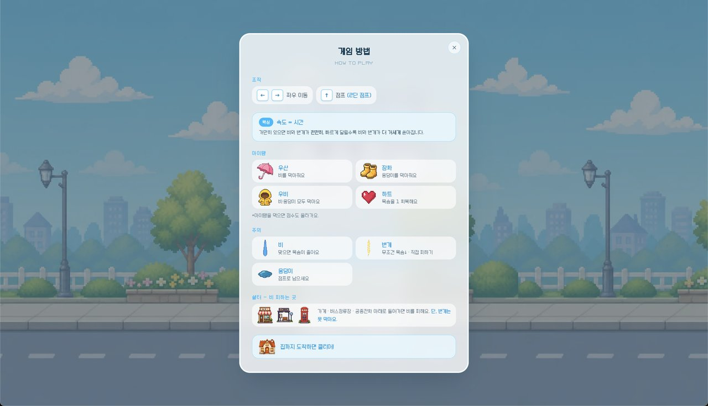
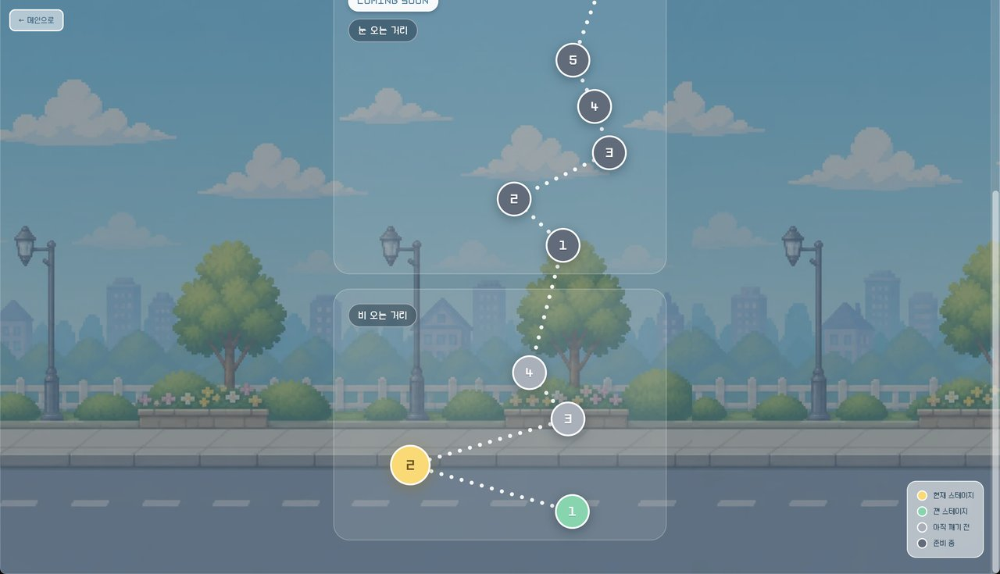
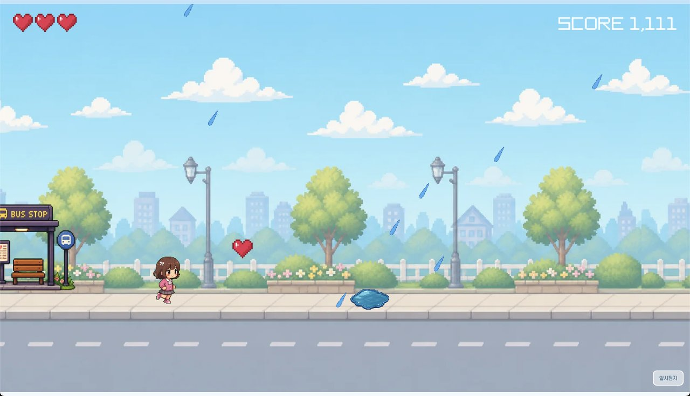

# Rain Dash

_블래스트 서비스 개발자 포지션 사전과제 — 이솔_

> Time moves when you move — 내가 빠르게 움직일수록 비와 번개는 거세게 몰아친다. 이를 피해 집까지 달리는 픽셀아트 런게임

- **데모**: https://rain-dash.vercel.app
- **레포지토리**: https://github.com/LEESOLL/rain-dash



|                      게임 방법                       |                     스테이지 맵                      |                         플레이                          |
| :--------------------------------------------------: | :--------------------------------------------------: | :-----------------------------------------------------: |
|  |  |  |

---

## 기획 의도

비 오는 거리를 달려 집까지 가는 게임. 단, **세상은 내가 멈추면 천천히 흐르고, 빠르게 움직이면 빠르게 흐른다.**
멈추면 비도 번개도 천천히, 달리면 한꺼번에 쏟아진다.

그래서 빠름이 정답이 아니다. 달리면 집은 가까워지지만 그만큼 비와 번개를 더 만나고, 멈추면 안전한 대신 한 발자국도 못 나아간다. **속도가 곧 위험과 보상을 동시에 정하는 구조.**

이 게임은 속도에 대해 세 가지로 답한다.

- **빠름** — 빨리 달릴수록 집은 가까워진다. 대신 비도 번개도 거세진다. 짜릿한 만큼 대가가 따른다.
- **느림** — 멈추면 시간이 느려지고, 번개를 읽고 피할 수 있다. 멈출 줄 아는 것도 속도다.
- **전혀 다른 것** — 내 움직임이 곧 세상의 시계. 내가 달려야 비도 번개도 흐르고, 멈추면 세상이 느려진다.

---

## How To Play

- **목표**: 비·웅덩이·번개를 피하며 집까지 도착하면 클리어.
- **핵심 메커닉**: 내가 움직이면 시간이 빠르게 흐른다. 멈추면 비·번개가 느려진다. → **속도를 내가 직접 조절**.
- **조작**
  - 데스크탑: `←` `→` `a` `d` 이동 / `↑` `w` `Space` 점프(2단 점프)
  - 모바일: 화면을 3등분하여 왼쪽 뒤로, 가운데 점프, 오른쪽 앞으로 (멀티터치로 달리면서 동시에 점프 가능)
- **위협**: 비·번개(경고 후 낙뢰, 멈추지 않으면 피하기 어려움)·물웅덩이(점프로 회피) → 목숨 -1
- **아이템**: 하트(목숨 회복)·우산(비 방어)·장화(웅덩이 방어)·우비(비·웅덩이 방어)
- **쉘터·집**: 가게·버스정류장·공중전화·집 — 지붕 아래로 들어가면 비를 막아줌(단, 번개는 못 막음)

---

## 점수 — 속도를 보상으로 번역

**움직이면 빠르게 쌓이고, 멈추면 천천히 쌓인다.** 빠르게 벌려면 비·번개가 거센 위험을 감수해야 하고, 안전을 택하면 점수는 더디게 오른다. 안전과 고득점을 동시에 쥘 수 없는 구조.

- **거리 × 속도 배수** — 움직이며 번 거리는 5배, 멈춰서 번 거리는 1배. 위험을 감수한 속도에 보상.
- **클리어 보너스** — 빠른 도착(시간 보너스) + 적은 피해(잔여 목숨 보너스). 속도와 생존 동시 보상.
- **베스트·NEW BEST 연출·누적 점수** — 기록 갱신과 재도전 유도.

→ "자주 멈춰 안전하게" vs "쉬지 않고 달려 고득점" 사이의 선택이 곧 플레이 스타일.

---

## 서비스 관점 — 유입·리텐션·확장성

단발 과제가 아니라 **운영하며 리텐션을 키우는 서비스**를 전제로 설계. "한 번 하고 마는 게임"이 아니라 "계속 하고 싶은 게임"이 목표.

### 유입 — 진입 마찰 최소화

익명 인증으로 가입 없이 즉시 플레이. 모바일은 텍스트 입력 자체가 마찰(키보드 가림)일 수 있어 닉네임 입력은 자동 생성으로 생략. UX가 불편한 가입 단계는 초기 이탈로 이어지기 쉬운 지점이라, 이를 없애 곧장 플레이로 진입하도록 설계.

### 리텐션 — 돌아올 이유를 단계마다

`진입` → `첫 클리어` → `베스트 갱신(NEW BEST)` → `랭킹 경쟁` → `다음 테마 기대`로 이어지는 흐름. 각 단계가 다음을 끌어당기도록 배치.

- **랭킹(누적/테마별)** — 재도전·경쟁 동기.
- **공정성** — 랭킹이 의미를 가지려면 동일 조건이 필요(불공정한 랭킹은 경쟁 동기 훼손 → 리텐션 누수). 웅덩이·아이템·쉘터 위치를 데이터로 고정해 모두에게 동일한 스테이지를 제공, 비·번개 빈도만 난이도별 조정.

### 확장성 — 콘텐츠를 계속 붙이는 구조

테마별 스테이지 묶음 + "Coming Soon". 비 오는 거리는 4스테이지까지 플레이 가능, 눈 오는 거리·운석 떨어지는 우주는 "Coming Soon"으로 예고해 다음 테마에 대한 기대감을 주고 재방문을 유도. 새 테마를 계속 붙일 수 있는 구조.

**로드맵**

- Firestore 보안 규칙(uid별 읽기/쓰기 제한) 적용
- 새 테마 맵(눈 오는 거리·우주) 콘텐츠 제작
- 마이페이지 — 닉네임 변경 + 플레이 통계(스테이지별 시도 횟수·클리어율·베스트 추이). 기록을 쌓고 관리하는 공간으로 재방문·리텐션 강화 (시도 횟수는 이미 적재 중)
- OAuth 2.0 소셜 로그인 — 현재 익명 인증·로컬 저장 기반 유저 데이터를 계정에 귀속, 기기 간 이어가기·데이터 영속 확보

---

## 설계 결정과 근거

| 결정                                                  | 근거                                                                                                                                                                                      |
| ----------------------------------------------------- | ----------------------------------------------------------------------------------------------------------------------------------------------------------------------------------------- |
| **이진 시간 스케일** (멈춤 0.1 / 이동 1.0)            | 가속형도 검토했으나, 속도를 "관리 부담"이 아닌 "직관적 리듬"으로 유지하기 위한 의도적 단순화.                                                                                             |
| **캔버스 게임 + DOM UI 하이브리드**                   | 게임은 Canvas 렌더, HUD·결과·로딩·일시정지는 DOM 오버레이로 분리 → 디자인 시스템 재사용·반응형 확보.                                                                                      |
| **스테이지 요소를 데이터로 고정** (랜덤 제거)         | 런타임 랜덤 배치는 플레이마다 난이도가 달라 유저 간 공정성 훼손 → 위치는 데이터로 고정, 비·번개 빈도만 난이도별 조정.                                                                     |
| **스테이지·랭킹 페이지 → 풀스크린 모달**              | 페이지 이동 시 BGM 끊김·배경 리셋 → 모달 전환으로 BGM 연속·배경 유지·"닉네임 없으면 진입 차단" 관문을 메인 한곳에 일원화.                                                                 |
| **진행도 localStorage → Firestore(`progress/{uid}`)** | localStorage 조작으로 스테이지를 임의 해제하는 것을 막기 위해 서버(uid) 관리. 인메모리 캐시 + 낙관적 갱신으로 동일 세션 즉시 반영.                                                        |
| **`useSyncExternalStore` 채택**                       | React 19 strict에서 effect 내 동기 `setState`의 cascading 렌더 경고 회피 — 외부 스토어 구독 패턴.                                                                                         |
| **에셋 로딩 게이트 + 최소 로딩 시간**                 | 로드 전 플레이스홀더 플래시 제거 + 캐시로 즉시 끝나도 깜빡이지 않게 최소 로딩 시간 보장.                                                                                                  |
| **16:9 레터박스 유지** (가변 폭 롤백)                 | 꽉 채우려 가변 폭 시도 → 모바일 렌더 부하로 프레임이 저하되는 이슈 발생 → 고정 비율로 복귀.                                                                                               |
| **세로 기기에서 게임만 CSS 회전**                     | 가로로 돌리라는 강제 대신 게임 캔버스만 CSS 회전 → 세로로 든 채(또는 기기를 돌려) 플레이. 게임 외 화면은 세로 유지, 인게임 오버레이는 컨테이너 쿼리(cqh)로 가로·세로 모두 한 화면에 맞춤. |
| **에셋 최적화** (webp·오디오)                         | 스프라이트 png→webp, BGM 비트레이트↓ → 에셋 용량 ~27MB→8MB 수준으로 절감해 초기 로딩 부담↓.                                                                                               |

---

## 구조

```
app/                      # 라우트 (App Router)
  page.tsx                # 메인 — 스테이지/랭킹은 모달로 진입
  play/[stageId]/page.tsx # 게임 화면
features/
  game/
    engine/               # 게임 엔진(상태·물리·렌더) — createEngine
    components/           # GameCanvas·StageGate(잠금 가드)·LoadingOverlay
  stage/                  # 스테이지 데이터·진행도·맵·모달
  ranking/                # 랭킹 저장소·스토어·모달
  user/                   # 익명 인증·닉네임
  settings/               # 설정 모달
  tutorial/               # 게임 방법(How To Play) 모달
components/               # GameButton·Modal·Select·PillTabs·ToggleButton
lib/                      # firebase·sound·orientation·touch·mainView·storage
public/                   # sprites·audio·fonts
```

- **엔진/렌더 분리** — 게임 로직은 순수 모듈(`createEngine`), React는 캔버스 마운트·상태 표시만 담당.
- **상태 관리** — 외부 가변 상태(진행도·랭킹·오디오·화면 방향·메인화면 뷰 상태)는 `useSyncExternalStore` 기반 스토어 구독.
- **라우팅·모달** — 게임은 별도 라우트, 그 외(스테이지/랭킹/설정/방법)는 메인 위 모달 → BGM 연속성·계정 관문을 메인에 일원화.
- **스테이지 진입 가드(`StageGate`)** — 진입 전 서버 진행도 확인, 잠긴 스테이지의 URL 직접 접근 차단.
- **데이터 모델(Firestore)** — `progress/{uid}`(클리어·베스트·누적 점수·스테이지별 시도 횟수), `rankings/{uid}`(닉네임·누적/테마별 점수). 익명 인증(uid)으로 식별.

---

## 디자인 시스템

- **vivid #00BCFE 토큰** — `@theme`에 색 스케일(sky/accent/danger), `:root`에 surface·text·line·radius·shadow 시맨틱 토큰.
- **공통 컴포넌트** — `GameButton`·`Modal`·`Select`·`PillTabs`·`ToggleButton`을 한 토큰 세트로 통일(버튼은 전부 `GameButton`).
- 모달(닉네임·설정·게임방법·랭킹)·스테이지 맵·결과/로딩 화면까지 같은 톤으로 일관.

---

## 기술 스택

- **Next.js 16**(App Router)·**React 19**·**TypeScript**
- **Tailwind CSS 4**·**HTML Canvas**(게임 렌더링)
- **Firebase**(Firestore + 익명 인증)
- **Vercel** 배포

---

## AI 활용

- **캐릭터 원안** — ChatGPT로 기반 디자인
- **스프라이트** — 에테르 AI로 스프라이트화(런 8프레임 등)
- **그 외 에셋**(아이템·오브젝트·배경·번개 등) — ChatGPT + 에테르 AI
- **UI 디자인**(버튼·모달·랭킹 등) — Claude로 디자인 시스템 구성·구현
- **개발** — Claude Code와 페어프로그래밍

> AI는 형태를 빠르게 잡는 도구로 활용 — 게임 로직·구조·기술 의사결정은 직접 설계.

---

## 실행 방법

```bash
# 1. 의존성 설치
npm install

# 2. 환경 변수 — .env.local 생성 후 Firebase 콘솔의 웹 앱 설정값 입력
#    NEXT_PUBLIC_FIREBASE_API_KEY=...
#    NEXT_PUBLIC_FIREBASE_AUTH_DOMAIN=...
#    NEXT_PUBLIC_FIREBASE_PROJECT_ID=...
#    NEXT_PUBLIC_FIREBASE_STORAGE_BUCKET=...
#    NEXT_PUBLIC_FIREBASE_MESSAGING_SENDER_ID=...
#    NEXT_PUBLIC_FIREBASE_APP_ID=...

# 3. 개발 서버
npm run dev

# 4. 프로덕션 빌드
npm run build && npm start
```
